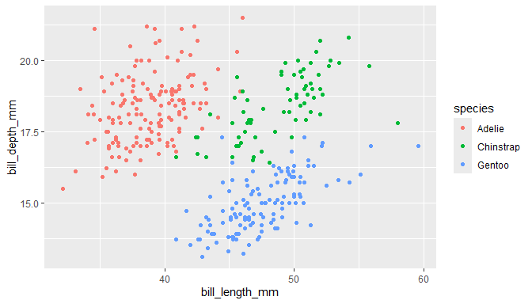

# Intro to Quarto part 2
Nyssa Silbiger
2025-09-30

<script src="Penguin2_files/libs/kePrint-0.0.1/kePrint.js"></script>
<link href="Penguin2_files/libs/lightable-0.0.1/lightable.css" rel="stylesheet" />


## Introduction

Today, we are learning about how to work with figures and themes

## Load the libraries

``` r
library(tidyverse)
library(here)
library(palmerpenguins)
library(kableExtra)
```

## Make a plot

``` r
penguins %>%
  ggplot(aes(x = bill_length_mm, y = bill_depth_mm, color = species))+
  geom_point()
```

<div id="fig-penguin-1">




Figure 1: This is a figure showing bill length by bill depth.

</div>

When you look at
<a href="#fig-penguin-1" class="quarto-xref">Figure 1</a> we can see
there is a positive relationship between bill length and bill depth.

``` r
penguins %>%
  group_by(species) %>%
  summarise(billmean = mean(bill_length_mm, na.rm = TRUE)) %>%
  kbl()  %>% # make it a kable table
  kable_classic() %>%
  row_spec(2, bold = TRUE, color = "white", background = "red")%>% # highlight row 2
  kable_styling(full_width = FALSE) # don't make it so wide
```

<div id="tbl-penguin">

Table 1: My awesome table

<div class="cell-output-display">

| species   | billmean |
|:----------|---------:|
| Adelie    | 38.79139 |
| Chinstrap | 48.83382 |
| Gentoo    | 47.50488 |

</div>

</div>

This is <a href="#tbl-penguin" class="quarto-xref">Table 1</a>
